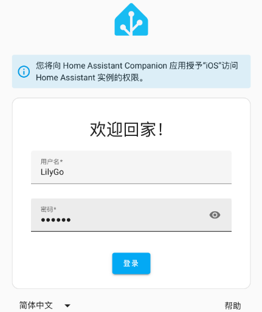

* * * <!--

        * @Description: None
        * @Author: LILYGO
        * @Date: 2025-06-09 15:13:14
        * @LastEditTime: 2025-06-09 15:13:14
        * @License: GPL 3.0
          -->

      <h1 align = "center">Home Assistant (ESPHome)</h1>

      ## **[English](./README.md) | 中文**

      ## VersionIteration:

      |         Version          | Update date |
      | :----------------------: | :---------: |
      | Home Assistant (ESPHome) | 2025-06-09  |

      ## Directory

      - [Describe](#Describe)
      - [Preview](#Preview)
        - [Building Home Assistant(ESPHome) on VMware](# Building Home Assistant(ESPHome) on VMware)
        - [Use Home Assistant on the mobile phone](#Use Home Assistant on the mobile phone)
      - [RelatedTests](#RelatedTests)
      - [FAQ](#FAQ)
  
      ## Describe

      Home-assistant is an open-source smart Home automation platform, which allows users to control and manage various smart devices in the home through a centralized system. Its design concept is to provide users with a solution that does not rely on a specific manufacturer. Therefore, it can integrate smart devices from different brands, offering users an open and customizable smart home experience. The core functions of Home-Assistant mainly include: real-time status update, automation, network triggering, status panel, Web service interface, voice control, notification service and plug-in system.

      ESPHome is a simple yet powerful system that enables users to control the development board using YAML configuration files. It enables users to quickly and easily build custom firmware for sensors and devices without any programming skills. ESPHome supports a long list of devices, sensors and protocols, which can be configured through a few lines of YAML. In addition, it can also control lights, displays and so on. It can be integrated with the family assistant with just a few clicks.

      ## Preview

      ### Example support

      | Example                                                     | `[ESPHome]`                              | Description | Picture |
      | ----------------------------------------------------------- | ---------------------------------------- | ----------- | ------- |
      | [relay](./example/relay.yaml)                               | <p align="center">![alt text][supported] |             |         |
      | [st7796_color_filling](./example/st7796_color_filling.yaml) | <p align="center">![alt text][supported] |             |         |
      | [st7796_show_text](./example/st7796_show_text.yaml)         | <p align="center">![alt text][supported] |             |         |
      | [CST226SE](./example/CST226SE.yaml)                         | <p align="center">![alt text][supported] |             |         |
      |                                                             |                                          |             |         |

      [supported]: https://img.shields.io/badge/-supported-green "example"

      ### Building Home Assistant(ESPHome) on VMware

      1. From [Home Assistant](https://www.home-assistant.io/installation/windows), the official web site, download VMware dedicated HAOS system.

         

      2. By decompressing the downloaded "Haos_OVa-15.2.vmdk.zip" file, we can obtain the image file "haos_ova-15.2.vmdk". Now, we need to put this file into the folder where you plan to install Home Assistant.

      3. Download and install [VMware](https://www.vmware.com/products/desktop-hypervisor/workstation-and-fusion) software (installed to skip this step).

      4. Open the VMware software and click "Create a New Virtual Machine".

         

      5. Click on Customization (Advanced), and then click Next.

         

      6. Hardware compatibility select "Workstation 17.x", and then click Next.

         

      7. Select "Install the operating System Later" and then click "Next".

         

      8. Select Linux as the client operating system, other Linux 5.x kernel 64-bit as the version, and then click Next.

         

      9. Name the virtual machine and its storage location. Here, the name I created is HomeAssistant, and then click Next.

         

      10. Set the processor configuration to default, and then click Next.

          

      11. Allocate 2048MB of virtual memory, and then click Next.

          

      12. For network connection, choose to use a bridge network.

          

      13. The I/O control type is set to default, and then click Next.

          

      14. The disk type is set to default, and then click Next.

          

      15. Select "Use Existing Virtual Disk" for the disk, and then click Next.

          

      16. Select the "haos_ova-15.2.vmdk" image file saved in the second step, and then click Next.

          

      17. Select "Keep the current format".

          

      18. Click "Finish".

          

      19. Click Edit Virtual Machine Settings, click Options -> Advanced -> Select UEFI Firmware Type, and then click OK.

          

          

      20. Click Edit Virtual Machine Settings again, click Hardware -> Network Adapter -> Customize: Specific Virtual Network, select VMnet0, and then click OK.

          

      21. Click "Edit" and select Virtual Network Editor.

          

      22. Select "Change Settings".

          

      23. Select VMnet0, choose your corresponding network card in bridge mode, and click OK after the selection is completed.

          

      24. Then click to start this virtual machine.

          

      25. After waiting for the initialization to be completed, you can see the IP address of the virtual machine and the port number of Home Assistant. For example, here with me, the IP address of the virtual machine is 192.168.36.128 and the server number of Home Assistant is 8123.

          

      26. Open the computer browser and enter the Address and port number of Home Assistant in the address bar, that is, the above IP4 Address for eth0 followed by: 8123. For example, in my case, it's 192.168.36.128:8123. Then press Enter to enter. When all the previous configurations are correct, the initialization page of Home Assistant can be seen:

          

      27. As long as you see the page "Preparing Home Assistant", it indicates that the initialization has started automatically. There is no need to perform any further operations. Just wait quietly. What needs to be noted here is the following sentence: "This will take at most 20 minutes."

          But in fact, in most home network environments, it takes far more than 20 minutes. So if you find that the status remains at this page all the time, you can click the small blue dot above to check the log. As long as there is time for an update, it indicates that the process is still ongoing. Please be patient and wait. During this process, never let the computer enter sleep mode and do not shut it down or cut off the power.

          After the initialization is completed, click "Create My Smart Home". We just need to fill in our names, usernames and passwords. It's best to take photos of this information to keep or write it down. Don't forget!

          

          

      28. After creating an account, enter the location selection. You can click the "Auto Check" button on the right to get your current location. The map loading speed will be relatively slow, so please be patient. Since location detection is based on IP addresses, the automatically detected location may slightly differ from your actual location. You can manually drag and drop the blue label on the map to precisely locate it. For some other Settings, such as country and region, language, time zone, altitude, currency, etc., we can keep them by default. Then click "Next".

          

          

      29. On the privacy Settings page, keep all options off by default, and then click Next.

          

      30. If a compatible device is found, simply click "Complete" by default.

          

      31. Now, we have entered the actual user interface of Home Assistant, which also indicates that Home Assistant begins to operate normally!

          

      32. Next is to install the ESPHome plugin. On the main page of Home Assistant, click on Settings at the lower left corner and then select add-ins.

          

      33. Click "Go to the Add-on Store".

          

      34. Then search for "ESPHome "in the search box and click on the first "ESPHome Device Builder" to enter the installation interface.

          

      35. Click to install. (The installation process may take a bit long. Please be patient.)

          

      36. After the installation is completed, turn on these three buttons and click Start.

          

      37. After the startup is completed, click to open the web interface.

          

      38. After opening the ESPHome interface, first click "'+ NEW DEVICE", and then click "CONTIUNE".

          

          

      39. Enter the name of the device and the Wi-Fi username and password you want to connect to. After completion, click NEXT.

          

      40. Select ESP32-S3.

          

      41.  After completion, click "SKIP" because we will manually configure this board.

          

      42. Click "EDIT" under the newly created Board.

          

      43. This will open a [YAML](./T-Connect-Pro.yaml) file, which will be used to set all board configurations. Edit the content under esp32-s3 and click INSTALL.

          

      44. Select "Plug into the computer running ESPHome Device Builder"。

          

      45.  Select the device's serial port.

          

      46. After the installation is complete, click STOP.

          

      47. After the development board successfully connects to WiFi, it will display "ONLINE".

          

      48. Now, you can disconnect the T-Connect Pro from the serial port of the virtual machine. Just power it through a USB data cable. This is because from now on, if you want to burn the firmware to the T-Connect Pro, you can simply do it via OTA instead of connecting to the virtual machine via a USB data cable.

          The following will write a simple routine to test it. Click "EDIT" to edit the yaml and add the code at the bottom:

          ```
          switch:
            - platform: gpio
              name: "Relay"
              pin: 8
              id: relay  # Ensure this ID is present
          
          # Automatically toggle relay every second
          interval:
            - interval: 1s
              then:
                - switch.toggle: relay  # Reference the defined ID
          ```

          

      49. After clicking INSTALL, click Wirelessly to burn the firmware via WiFi and wait for the upload to complete.

          

      50. After the upload is successful, you can see the relay on the board cycling on and off, with a one-second interval in between.

          

          

      ### Use Home Assistant on the mobile phone

      1. Download and install Home Assistant in the mobile app store.

      2. The network connected to the mobile phone should be in the same local area network as Home Assistant. Open the Home Assistant application. You can see that the address of Home Assistant has been displayed. Click to connect.

         

      3. Log in by entering the previously registered account name and password.

         

      4. After logging in successfully, open the ESPHome operation interface.

         

         

      5. After opening it, you can write the yaml configuration file on your mobile phone and upload the updated firmware via WiFi (consistent with the operation in Step 49).

      ## RelatedTests

      Upload the sample code. Please copy the code in the example to "captive_portal:" and then upload it. You can also directly use [t-connect-pro.yaml](./t-connect-pro.yaml), but the corresponding key and password need to be changed to yours. Functionality to "############ xxxxxx ############" segmentation, need which function is opened which features of annotation can be.

      

      ## FAQ

      * Q. Why can't I connect Home Assistant on my mobile phone APP?
    * A.  Please connect your mobile phone's network to the same local area network as the virtual machine.
