<!--

 * @Description: None
 * @Author: LILYGO
 * @Date: 2025-06-09 17:50:14
 * @LastEditTime: 2025-06-09 17:50:14
 * @License: GPL 3.0
-->
<h1 align = "center">Home Assistant (ESPHome)</h1>

## **[English](./README.md) | 中文**

## 版本迭代:
| Version                               | Update date                       |
| :-------------------------------: | :-------------------------------: |
| Home Assistant (ESPHome) | 2025-06-09                 |

## 目录
- [描述](#描述)
- [软件部署](#软件部署)
  - 在VMware上搭建Home Assistant(ESPHome)
  - 在手机上使用Home Assistant
- [相关测试](#相关测试)
- [常见问题](#常见问题)
- [项目](#项目)

## 描述

Home-Assistant是一个开源的智能家居自动化平台，它允许用户通过一个中心化的系统来控制和管理家中的各种智能设备。 它的设计理念是为用户提供一个无需依赖特定制造商的解决方案，因此，它可以集成来自不同品牌的智能设备，为用户提供一个开放且可定制的智能家居体验。 Home-Assistant的核心功能主要包括：实时状态更新、自动化、网络触发、状态面板、Web服务接口、语音控制、通知服务和插件系统。

ESPHome是一个简单但功能强大的系统，允许用户使用YAML配置文件控制开发板。它允许用户在没有任何编程技能的情况下快速轻松地为传感器和设备构建定制固件。ESPHome支持一长串设备、传感器和协议，这些设备、传感器和协议可以通过几行YAML进行配置。除此之外，它还可以控制灯光、显示器等等。它可以集成与家庭助理在几次点击。

## 软件部署

### 示例支持

| Example | `[ESPHome]` | Description | Picture |
| ------  | ------ | ------ | ------ |
| [relay](./example/relay.yaml) | <p align="center">![alt text][supported] | | |
| [st7796_color_filling](./example/st7796_color_filling.yaml) | <p align="center">![alt text][supported] |             |         |
| [st7796_show_text](./example/st7796_show_text.yaml) | <p align="center">![alt text][supported] |             |         |
| [CST226SE](./example/CST226SE.yaml) | <p align="center">![alt text][supported] | | |
| | | | |

[supported]: https://img.shields.io/badge/-supported-green "example"

## 在VMware上搭建Home Assistant(ESPHome)
1. 从[Home Assistant](https://www.home-assistant.io/installation/windows)官方网站，下载VMware专用的HAOS系统。

   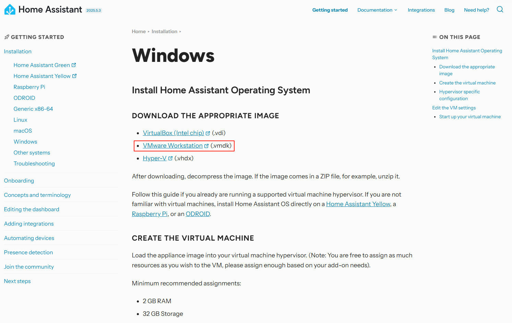

2. 解压缩下载的这个"haos_ova-15.2.vmdk.zip"文件，我们可以得到"haos_ova-15.2.vmdk"这个镜像文件。现在，我们需要将这个文件放到你打算安装Home Assistant的文件夹中。

3. 下载安装[VMware](https://www.vmware.com/products/desktop-hypervisor/workstation-and-fusion)软件（已安装跳过此步骤）。

4. 打开VMware软件，点击创建新的虚拟机。

   

5. 点击自定义(高级)，然后点击下一步。

   

6. 硬件兼容性选择"Workstation 17.x"，然后点击下一步。

   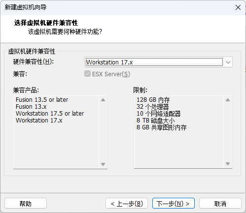

7. 选择稍后安装操作系统，然后点击下一步。

   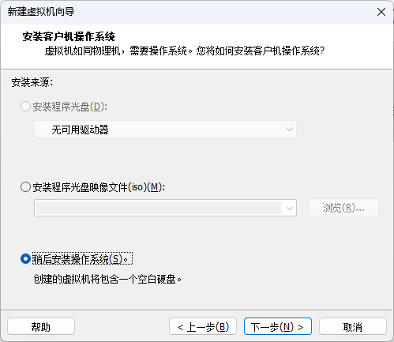

8. 客户机操作系统选择Linux，版本选择其他Linux 5.x内核64位，然后点击下一步。

   

9. 给虚拟机命名以及存放位置，这里我创建的名字是HomeAssistant，然后点击下一步。

   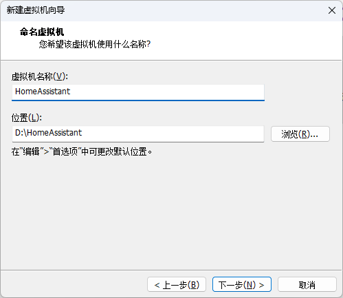

10. 处理器配置默认，然后点击下一步。

    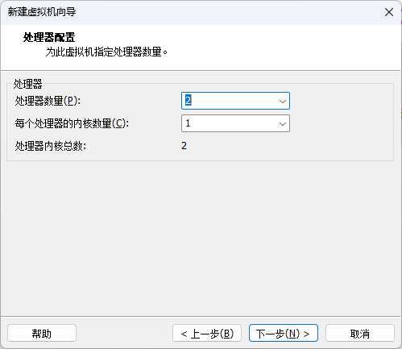

11. 虚拟内存分配2048MB，然后点击下一步。

    

12. 网络连接选择使用桥接网络。

    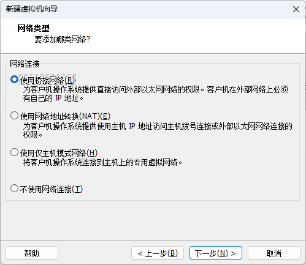

13. I/O控制类型默认，然后点击下一步。

    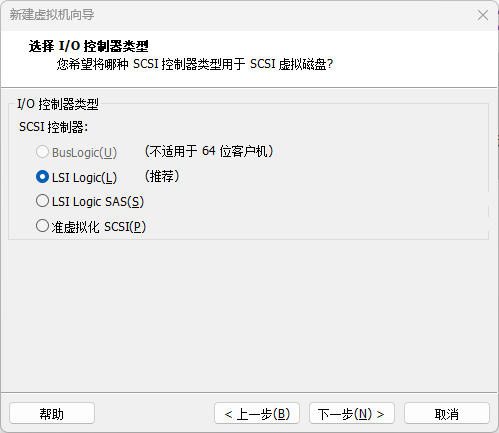

14. 磁盘类型默认，然后点击下一步。

    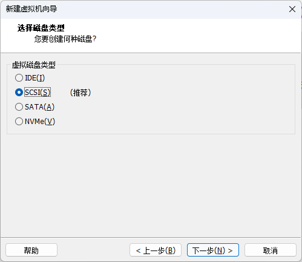

15. 磁盘选择"使用现有虚拟磁盘"，然后点击下一步。

    

16. 选择第二步中保存的"haos_ova-15.2.vmdk"镜像文件，然后点击下一步。

    

17. 选择"保持现有格式"。

    

18. 点击完成。

    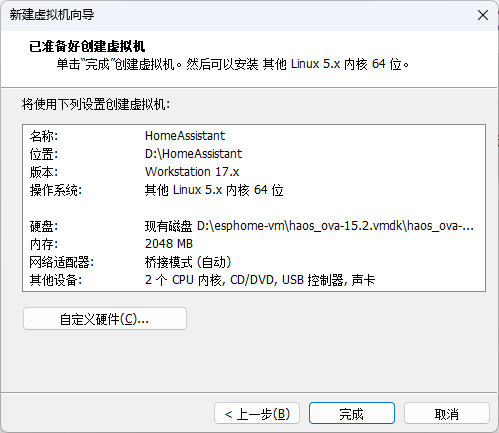

19. 点击编辑虚拟机设置，点击选项->高级->固件类型选择UEFI，然后点击确定。

    

    

20. 再次点击编辑虚拟机设置，点击硬件->网络适配器->自定义:特定虚拟网络，选择VMnet0，然后点击确定。

    

21. 点击编辑，选择虚拟网络编辑器。

    

22. 选择更改设置。

    

23. 选择VMnet0，在桥接模式下选择自己对应的网卡，选择完成后点击确定。

    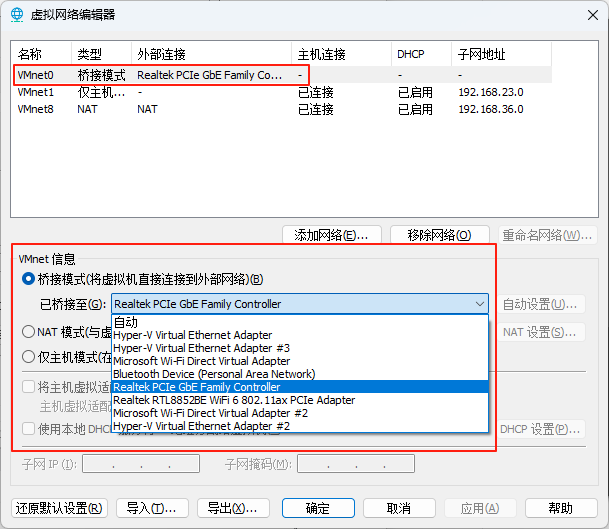

24. 然后点击开启此虚拟机。

    

25. 等待初始化完成后，就可以看到虚拟机的IP地址和Home Assistant的端口号了。比如我这里，虚拟机IP地址是192.168.36.128, Home Assistant服务端口号是8123。

    

26. 打开电脑浏览器，在地址栏中输入Home Assistant的地址和端口号，也就是上面的IP4 Address for eth0后面加：8123。比如我这里，就是192.168.36.128:8123，然后回车进入即可。在前面一切配置都正确的情况下，就可以看到Home Assistant的初始化页面了：

    

27. 只要看到“正在准备 Home Assistant”的页面，就说明初始化已经自动开始了，不需要再进行任何操作，只要安静等待即可。这里要注意的就是下面的这句话“这需要花费至多20分钟时间”。

    但实际上，大多数家庭网络环境中，都需要远远超过20分钟的时间。所以如果你发现状态一直停留在这个页面的话，可以点击上面的蓝色小圆点查看一下日志。只要有时间更新，就说明进程仍在继续，请一定要耐心等待。这个过程中，千万不要让电脑进入休眠状态，不要关机断电。

    初始化完成后，点击创建我的智能家居，我们只要填入自己的姓名，用户名和密码即可。最好把这些信息拍照保留或写下来，不要忘记！

    

    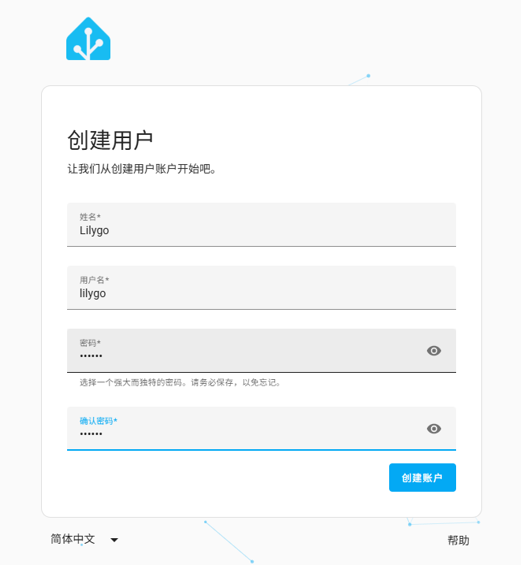

28. 创建账户之后，进入位置选择，可以通过点击右侧的“自动检测”按键，获取你当前的位置，地图加载的速度会比较慢，请耐心等待。由于地理位置检测是基于IP地址的，因此自动检测出来的位置可能会和自己真正的位置略有区别，可以手动拖拽地图上的蓝色标签来精确定位。其他的一些设置，如国家地区/语言/时区/海拔/货币等，我们保持默认即可。然后点击下一步。

    

    

29. 在隐私设置页面中，所有选项保持默认的关闭状态，然后点击下一步。

    

30. 发现了兼容的设备，默认点完成即可。

    

31. 现在，我们就进入Home Assistant真正的使用界面了，这也代表着Home Assistant开始正常运行！

    

32. 接下来就是安装ESPHome插件，在Home Assistant的主页面中，点击左下角的设置，然后选择加载项。

    

33. 点击"前往加载项商店"。

    

34. 然后在搜索框中搜索ESPHome，点击第一个"ESPHome Device Builder"进入安装界面。

    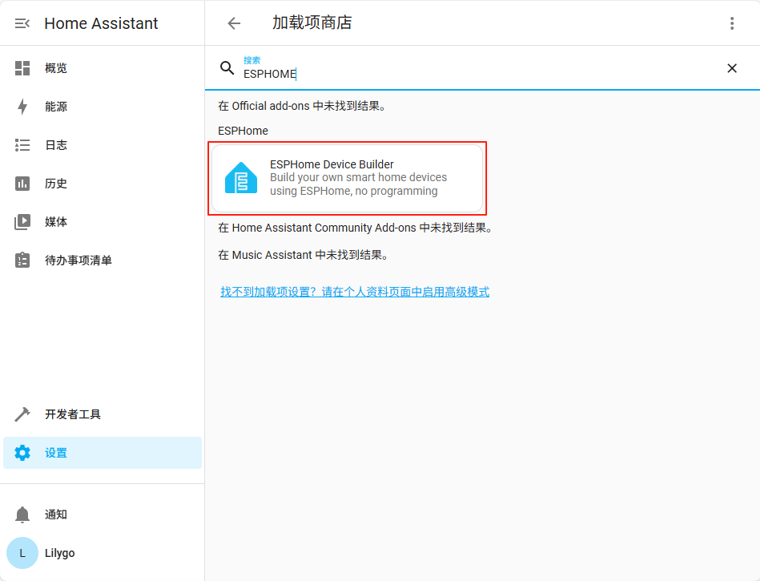

35. 点击安装（安装过程有点久，请耐心等待）。

    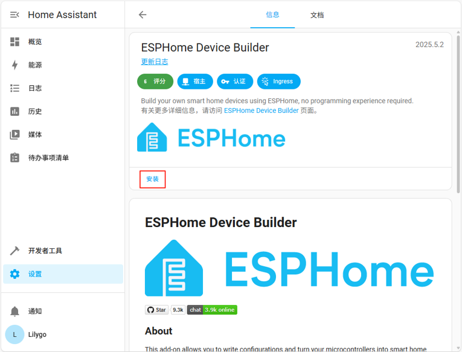

36. 安装完成后，将这三个按钮打开后点击启动。

    

37. 启动完成后，点击打开网页界面。

    

38. 打开ESPHome界面后，首先点击"'+ NEW DEVICE"后，点击"CONTIUNE"。

    

    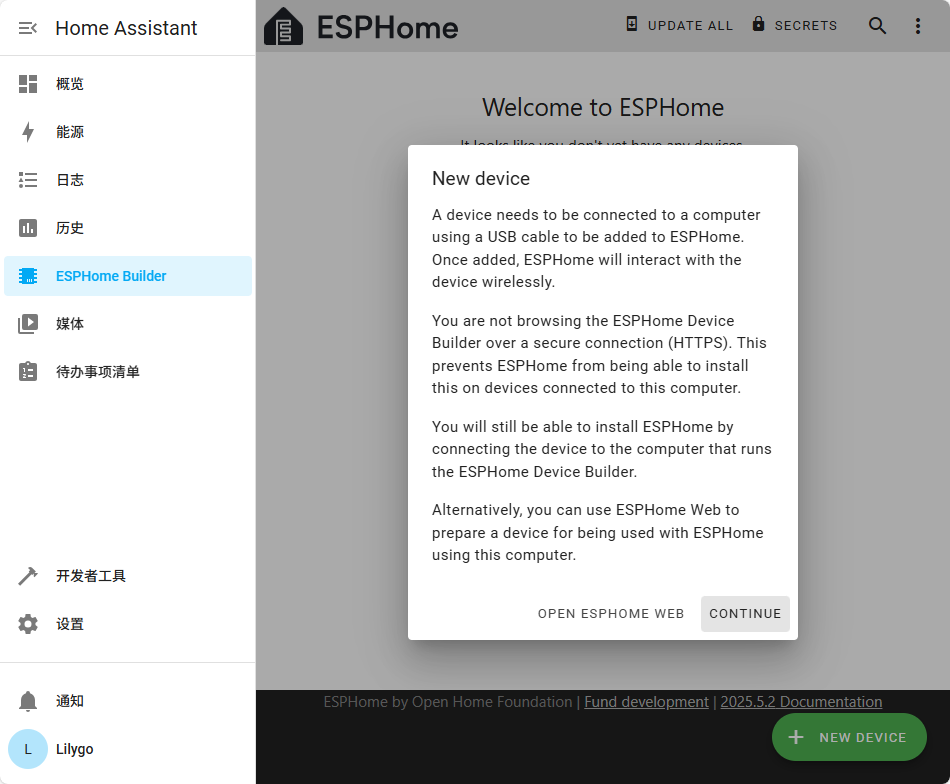

39. 输入设备的名称和要连接的WIFI用户名和密码，完成后点击NEXT。

    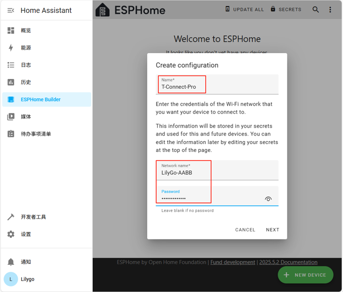

40. 选择ESP32-S3。

    

41. 完成后点击SKIP后，因为我们将手动配置此板。

    

42. 点击新创建的 Board 下的 EDIT。

    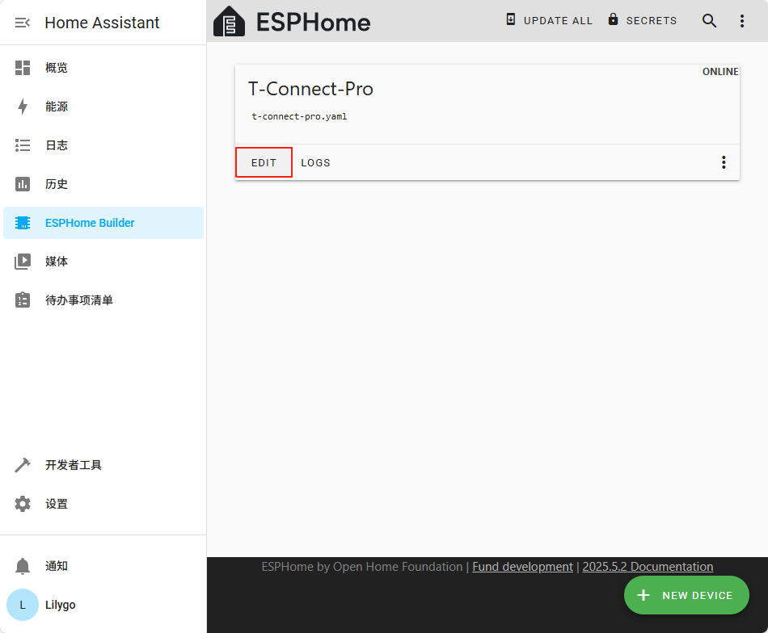

43. 这将打开一个 [YAML](./T-Connect-Pro.yaml) 文件，此文件将用于设置所有板配置。编辑 esp32-s3 下的内容，点击INSTALL。

    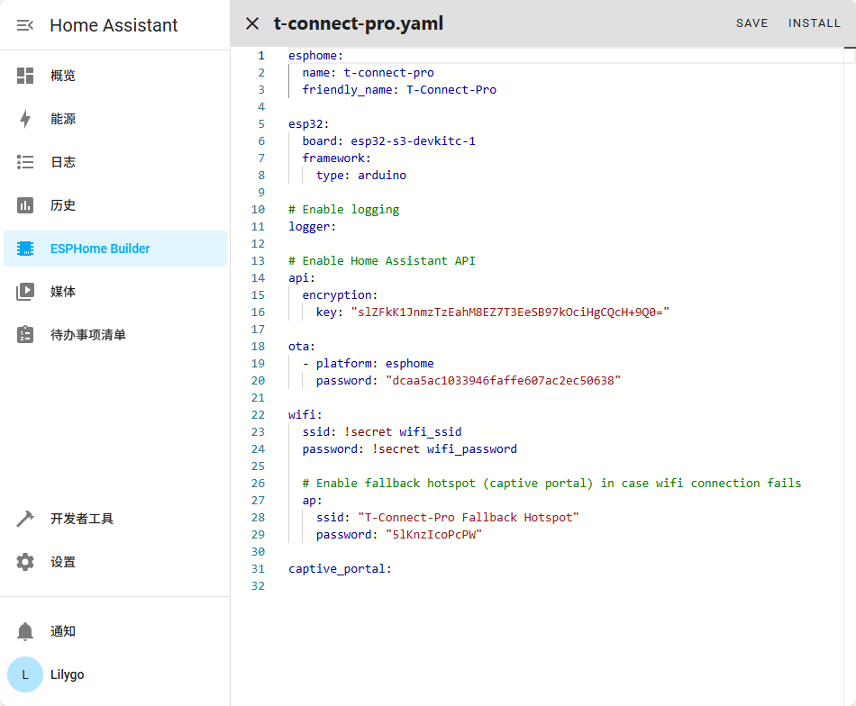

44. 选择"Plug into the computer running ESPHome Device Builder"。

    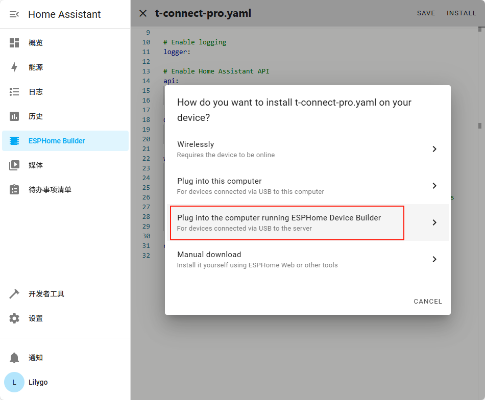

45. 选择设备串口。

    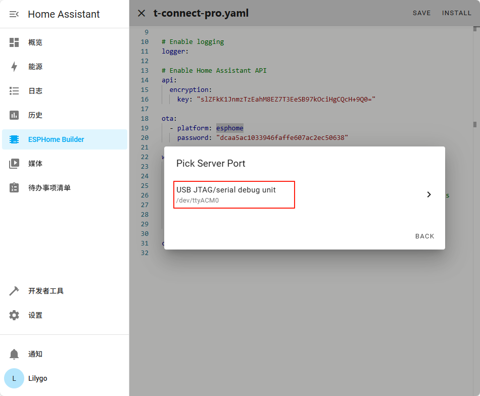

46. 等待安装完成后，点击STOP即可。

    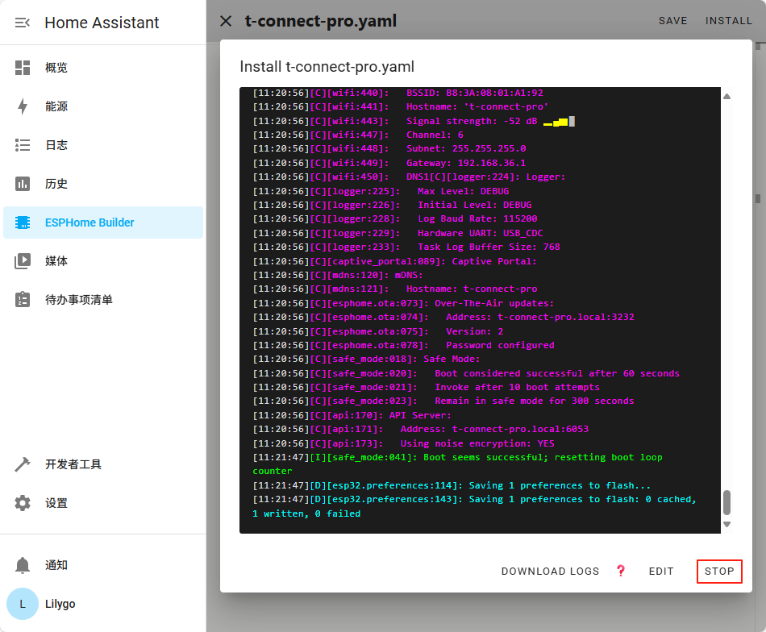

47. 开发板成功连接WiFi后会显示ONLINE。

    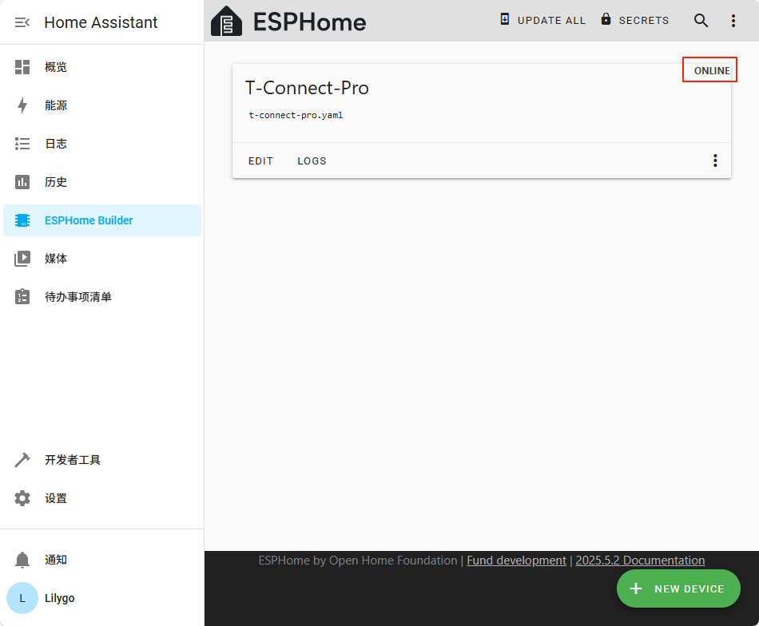

48. 现在，您可以断开T-Connect Pro和虚拟机串口的连接，只需通过 USB 数据线为其供电即可。这是因为从现在开始，如果你想将固件烧录到T-Connect Pro，你可以简单地通过 OTA 进行，而无需通过 USB 数据线连接到虚拟机。

    下面将写一个简单的例程测试一下，点击EDIT编辑yaml，在底下添加代码：

    ```
    switch:
      - platform: gpio
        name: "Relay"
        pin: 8
        id: relay  # Ensure this ID is present
    
    # Automatically toggle relay every second
    interval:
      - interval: 1s
        then:
          - switch.toggle: relay  # Reference the defined ID
    ```

    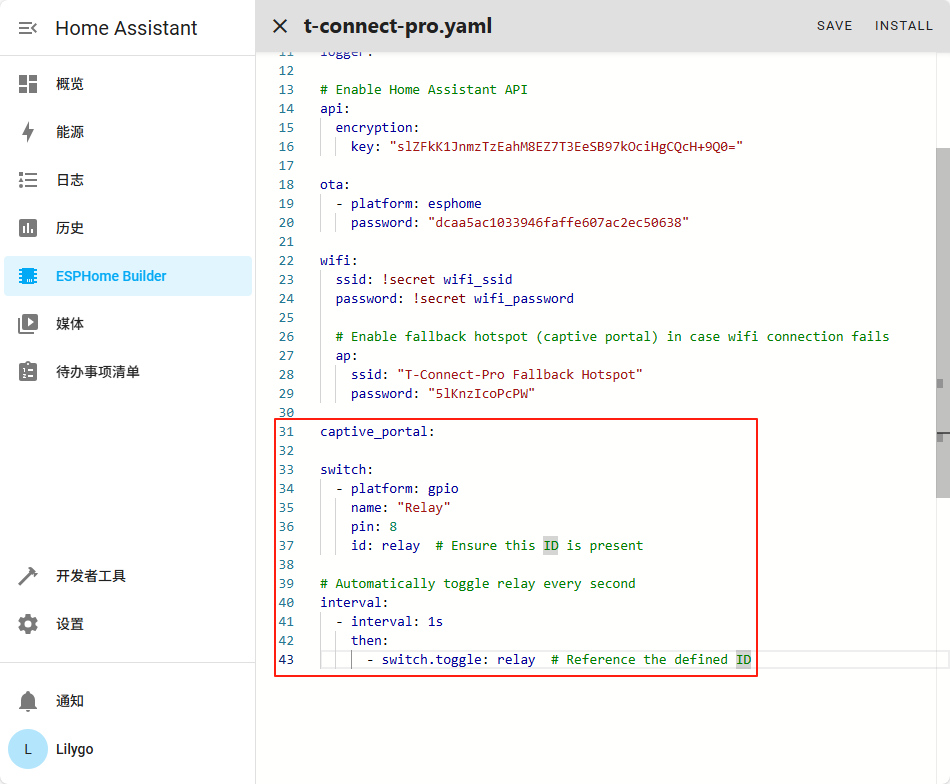

49. 点击INSTALL后，点击Wirelessly进行WiFi烧录固件，等待上传完成。

    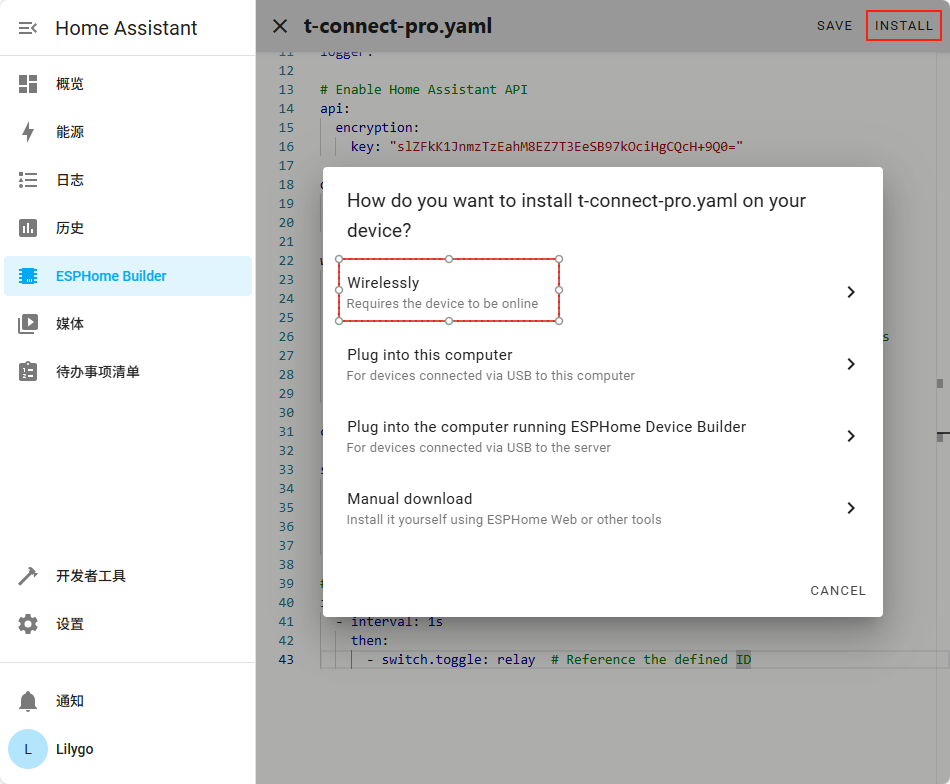

50. 上传成功后，可以看到板子上的继电器在循环的开和关，中间间隔一秒。

    

    

## 在手机上使用Home Assistant

1. 在手机应用商店中下载安装Home Assistant。

2. 手机连接的网络要和Home Assistant连接在同一局域网下，打开Home Assistant应用程序，可以看到Home Assistant地址已经显示，点击连接。

   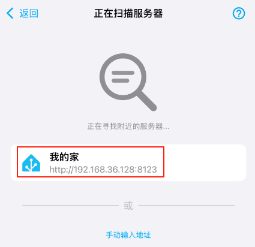

3. 输入之前注册的账户名和密码登录。

   

4. 登录成功后打开ESPHome操作界面。

   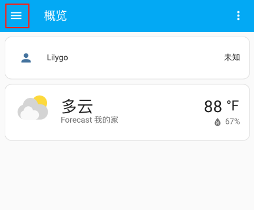

   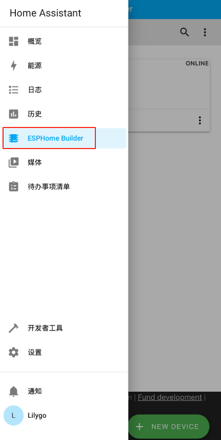

5. 打开后即可实现手机编写yaml配置文件，通过WiFi上传更新固件（与步骤49操作一致）。

## 相关测试

上传示例代码请将example中的代码复制到"captive_portal:"后上传即可，也可以直接使用[t-connect-pro.yaml](./t-connect-pro.yaml)，但是对应的key和password需要更换成你的，功能以"\############ xxxxxx ############"分割，需要哪个功能就打开哪个功能的注释即可。

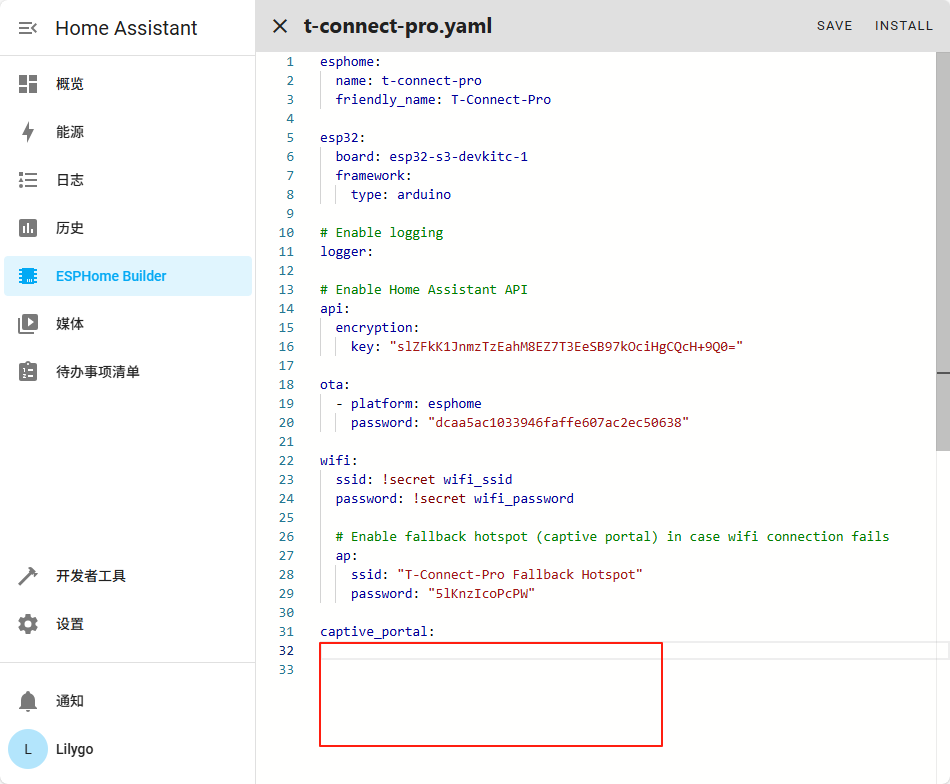

## 常见问题

* Q. 为什么我的手机APP上无法连接Home Assistant？
* A. 请将手机的网络连接到与虚拟机同一局域网下。
